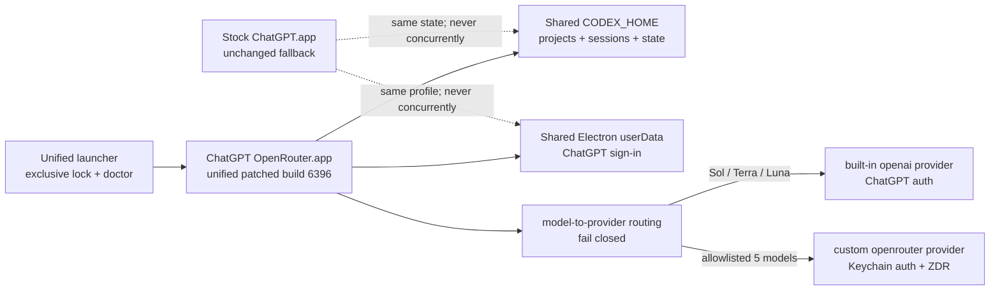

# Codex Unified Router: GPT-5.6 / OpenRouter 統合・セッション継続計画

作成日: 2026-08-12

対象: ChatGPT `26.803.61601` build `6396`、`codex/build-6396-adapter`

状態: 計画レビュー済み。実装着手はGo、candidateのPROMOTE・Releaseはゲート通過までNo-Go。

## 1. 決定

既存の`Codex OpenRouter.app`をOpenRouter専用cloneではなく、次の8モデルを1つのpickerから選べる統合routerへ発展させる。不要なLaunchServices・installer移行を増やさないため、ファイル名と通常入口は維持する。

| provider | model ID | picker表示 | 認証・課金 |
|---|---|---|---|
| OpenAI native | `gpt-5.6-sol` | `[OpenAI] 5.6 Sol` | ChatGPT sign-in / ChatGPT Credits |
| OpenAI native | `gpt-5.6-terra` | `[OpenAI] 5.6 Terra` | ChatGPT sign-in / ChatGPT Credits |
| OpenAI native | `gpt-5.6-luna` | `[OpenAI] 5.6 Luna` | ChatGPT sign-in / ChatGPT Credits |
| OpenRouter | `deepseek/deepseek-v4-flash-0731` | `[OpenRouter] deepseek-v4-flash-0731...` | Keychain / OpenRouter |
| OpenRouter | `deepseek/deepseek-v4-pro` | `[OpenRouter] deepseek-v4-pro...` | Keychain / OpenRouter |
| OpenRouter | `moonshotai/kimi-k3` | `[OpenRouter] kimi-k3...` | Keychain / OpenRouter |
| OpenRouter | `z-ai/glm-5.2` | `[OpenRouter] glm-5.2...` | Keychain / OpenRouter |
| OpenRouter | `minimax/minimax-m3` | `[OpenRouter] minimax-m3...` | Keychain / OpenRouter |

OpenAI公式のGPT-5.6 familyはSol、Terra、Lunaの3モデルである。[Models](https://learn.chatgpt.com/docs/models#recommended-models) `gpt-5.6`はCLIの選択aliasとして扱い、4つ目のpicker itemにはしない。GPT-5.3 Codex Sparkは5.6系ではないので今回追加しない。

日常利用は統合パッチ版へ寄せる。純正`/Applications/ChatGPT.app`は署名済みstock、更新元、緊急ロールバック入口として不変のまま残す。セッション・project表示を統合するため、パッチ版は純正と同じ`CODEX_HOME`とElectron userDataを利用してよい。ただし、**純正とパッチ版の同時起動を禁止し、起動時に相互排他lockとprocess検査を必須にする**。

## 2. 利用者が得る最終状態

- 左sidebarに従来の純正Codex project/sessionと統合パッチ版sessionが同じように表示される。
- 新規threadでGPT-5.6三系統または指定OpenRouter五モデルを選択できる。
- 既存の純正threadをGPT-5.6のまま続けられる。
- 純正threadをOpenRouterで続けたい場合は、同じ履歴から新しいthreadへforkして継続できる。
- OpenRouter threadからGPT-5.6へ戻す場合も同様にforkし、元threadを監査可能なまま残す。
- picker、thread header、実行確認にproviderを表示し、ChatGPT CreditsとOpenRouter課金を取り違えない。
- OpenRouter五モデルだけにZDR Guardrailを適用し、OpenAI native通信をOpenRouterへ送らない。

## 3. 公式仕様と今回の設計判断

- OpenAI公式はCodexで`gpt-5.6-sol`、`gpt-5.6-terra`、`gpt-5.6-luna`を案内している。[Models](https://learn.chatgpt.com/docs/models#recommended-models)
- custom providerは組み込み`openai`を上書きせず、別IDとして追加できる。command-backed authenticationも利用できる。[Advanced Configuration](https://learn.chatgpt.com/docs/config-file/config-advanced#custom-model-providers)
- App Serverの`thread/list`は`modelProviders` filterを持ち、空配列なら全providerを表示できる。[Codex App Server](https://learn.chatgpt.com/docs/app-server)
- `turn/start`は既存threadに対してmodelを上書きでき、その指定は以後のturnの既定になる。[Codex App Server](https://learn.chatgpt.com/docs/app-server)
- 異なるmodelでresumeすると警告と一度限りのmodel-switch instructionが入る。[Codex App Server](https://learn.chatgpt.com/docs/app-server)
- providerをまたぐ履歴継続は、元threadへ直接appendするより`thread/fork`で新IDへ分岐する。`forkedFromId`と`sessionId`を保持でき、誤課金・誤routing時の監査とrollbackが明確になる。

公式文書はmodel変更時の挙動を示すが、異provider間のresumeでprovider自体が安全に切り替わることまでは明記していない。installed buildから生成したstable App Server schemaでは`thread/fork`が`model`と`modelProvider`を受け、`turn/start`は`model`だけを受ける。したがってprovider切替はcandidate実機で`thread/fork(model, modelProvider) -> turn/start(model)`のwire request、responseの`modelProvider`、実provider証跡まで検証する。

## 4. 構成



### 4.1 正本

- session/project/state正本: 既存`/Users/<user>/.codex`
- Electron userData正本: `/Users/<user>/Library/Application Support/Codex`
- OpenRouter credential: macOS Keychain helper
- stock app: `/Applications/ChatGPT.app`。ASAR変更・ad-hoc署名禁止
- patched clone: `/Users/<user>/Applications/ChatGPT OpenRouter.app`
- 通常入口: `/Users/<user>/Desktop/Codex OpenRouter.app`

旧`~/.codex-openrouter`は移行元として読み取り専用で扱い、即削除しない。既存OpenRouter 2 threadを共有HOMEへ移す場合は、provider metadataとthread ID衝突を検査したcopy/fork migrationを別工程で行う。

### 4.2 同時実行禁止

共有HOMEとuserDataを採用する代わりに、launcherは次をfail-closedで確認する。

1. stock ChatGPT main processが0件。
2. patched clone main processが0件または期待userDataを持つ1件。
3. `CODEX_HOME/run/unified-router.lock`を`flock`相当で保持できる。
4. Electron profile lockが残っていない、または既存patched PIDに属する。
5. app/build/userData schemaの互換性が確認済み。

build 6396実機ではbundle IDが`com.openai.codex`、Chromium profileに`SingletonLock`が存在することを確認済みである。patched executableも`--user-data-dir=/Users/<user>/Library/Application Support/Codex`を明示し、期待path以外では起動しない。

stock起動用にも安全な入口`codex-stock-safe`を用意し、patched PIDとlockが残っていればstockを起動しない。Dock、Finder、Login Itemsなどlauncherを迂回する起動は技術的に完全阻止できないため、日常入口を両方とも専用launcherに置換し、doctorで逸脱processを検出する。OS上の直接起動を完全に防げないことは残余リスクとして明記する。

`codex-stock-safe`はbuild 6396のnative三モデルだけを使用するfallback入口とする。起動前にトップレベル`model_provider`が未設定であること、既定modelがnative allowlist内であることを確認し、OpenRouter modelが選択状態なら`gpt-5.6-sol`への変更を利用者へ明示してから行う。共有configにcustom provider定義が残っていても、stockからOpenRouterの新規turnを開始する経路は正常化完了条件に含めない。

## 5. モデルカタログ契約

### 5.1 合成方法

現在のOpenRouter専用`model_catalog_json`はnative catalogを置換し、OpenRouter五モデルだけを返す。統合版では起動対象buildに同梱されたCodex binaryの`codex debug models --bundled`を正本として、次のruntime composite catalogを原子的に生成する。

1. bundled catalogからslug完全一致でGPT-5.6三系統だけを抽出する。
2. repo registryで検証済みのOpenRouter五モデルを追加する。
3. slug重複、schema、reasoning、tool、modality、context契約を検証する。
4. `~/.codex/model-catalogs/unified-router.json`へexact 8を出力する。
5. user-level `model_catalog_json`をこのcompositeへ向ける。
6. App ServerとDesktop pickerが同じexact 8を返すことを確認する。

native GPT-5.6 entryはrepoへ静的複製せず、各対応buildから再生成する。bundled catalogが三系統を各1件で返さない場合は停止する。OpenAI側でアカウント利用不可のモデルがある場合は偽の利用可能表示をせず、pickerでdisabledまたは開始時に明確な認証・権限エラーを返す。

### 5.2 exact model set

- 許可: GPT-5.6三系統 + OpenRouter五モデル = 8
- `gpt-5.6` aliasは内部解決用のみで独立表示しない。
- GPT-5.5、GPT-5.4、GPT-5.3 Codex Spark、Qwen、その他hidden/preview modelは今回表示しない。
- OpenAIのnative model family変更を検出しても自動追加しない。仕様確認後に契約更新する。
- OpenRouter profile変更、canonical slug変更、reasoning metadata変更は従来どおり停止する。

### 5.3 reasoning契約

- `gpt-5.6-sol`: native bundled/runtime catalogを正本とし、現buildでは`low/medium/high/xhigh/max/ultra`を期待。
- `gpt-5.6-terra`: native bundled/runtime catalogを正本とし、現buildでは`low/medium/high/xhigh/max/ultra`を期待。
- `gpt-5.6-luna`: native bundled/runtime catalogを正本とし、現buildでは`low/medium/high/xhigh/max`を期待。
- OpenRouter五モデル: repo registryとZDR endpoints APIの契約を維持する。MiniMaxはprovider-controlled。
- native catalogと期待値が変わった場合、OpenAIモデルを偽装せずcandidateを停止して再調査する。

## 6. provider routing契約

### 6.1 mapping

`desktop-model-providers.json`は次を表現する。

```json
{
  "version": 1,
  "default_provider": "openai",
  "providers": [
    {"id": "openai", "label": "ChatGPT / OpenAI"},
    {"id": "openrouter", "label": "OpenRouter"}
  ],
  "model_providers": {
    "gpt-5.6-sol": "openai",
    "gpt-5.6-terra": "openai",
    "gpt-5.6-luna": "openai",
    "deepseek/deepseek-v4-flash-0731": "openrouter",
    "deepseek/deepseek-v4-pro": "openrouter",
    "moonshotai/kimi-k3": "openrouter",
    "z-ai/glm-5.2": "openrouter",
    "minimax/minimax-m3": "openrouter"
  }
}
```

GPT-5.6三系統も`openai`へ明示mappingする。`default_provider`はconfig schema互換のため存在するが、request routingでは未知modelのfallbackに使わない。allowed native setとallowed OpenRouter setの和集合だけを受理し、それ以外はrouting errorとして停止する。

### 6.2 request別の処理

- `thread/list`: `modelProviders: []`を補い、両providerのthreadを一覧化。
- `thread/start`: `params.model`をexact allowlistで引き、`modelProvider`を明示設定。
- `thread/resume`: providerを変えない単純再開だけを許可。provider変更要求は直接resumeせずfork flowへ送る。
- `thread/fork`: `params.model`と`params.modelProvider`を同じmappingから同時に設定し、元threadの履歴から選択providerの新IDを作る。
- `turn/start`: schema上`modelProvider`を受けないため、`params.model`がある場合はallowlistから期待providerを求め、loaded threadの`modelProvider`と一致する場合だけ許可する。不一致ならfork flowへ誘導して停止する。
- requestに既存`modelProvider`がある場合も、modelとのmapping一致を検査し、不一致なら上書きせず停止する。

現在のbuild 6396 semantic candidateは`thread/start`を無条件`openrouter`へする暫定版である。これをそのまま固定adapterにしない。上流V3本来のmodel mapping logicをbuild 6396のES module / request queue形状へ移植し、`turn/start`とfork gateを追加する。

### 6.3 誤routing防止

- native GPT-5.6 requestにOpenRouter bearer tokenを付けない。
- OpenRouter requestにChatGPT token、Cookie、attestation値を付けない。
- provider決定不能時にdefault providerへ黙ってfallbackしない。
- pickerの手動provider overrideは初期版では無効化する。同じmodel IDを別providerへ送る機能は提供しない。
- provider、model、thread ID、request種別だけをredacted監査ログへ残す。token、prompt、response本文は残さない。

### 6.4 shared config契約

現行`~/.codex/config.toml`はトップレベル`model = "gpt-5.6-sol"`で、トップレベル`model_provider`と`model_catalog_json`は未設定である。統合版は既存project、MCP、plugin、desktop設定を保持し、次の管理対象だけを変更する。

- `model_catalog_json = "/Users/<user>/.codex/model-catalogs/unified-router.json"`
- `[model_providers.openrouter]`
- `[model_providers.openrouter.auth]`

トップレベル`model_provider`は設定しない。設定編集はapp停止中だけに行い、対象key/sectionのpreimageとconfig全体hashを記録して原子的に置換する。rollbackは管理対象だけをpreimageへ戻し、統合版利用中に変更された無関係なproject、MCP、plugin、desktop設定を巻き戻さない。config構造が予期せず変更され、安全に対象sectionだけを戻せない場合は自動restoreせず停止する。

## 7. 認証と課金境界

### OpenAI native

- 既存ChatGPT userDataで利用者が通常sign-inする。
- built-in`openai` providerとChatGPT認証を使用する。
- `model_providers.openai`を定義・上書きしない。
- 利用可能性、rate/context/credit制約はChatGPTアカウントに従う。

### OpenRouter

- `[model_providers.openrouter]`だけをuser-level configで追加する。
- API keyはmacOS Keychain helperからcommand-backed authで取得する。
- `OPENROUTER_API_KEY`をapp環境、引数、config、logへ渡さない。
- Guardrail `codex-zdr`、exact 5 models、`allow_fallbacks=false`、実providerをcanaryで確認する。

pickerと開始確認には`OpenAI / ChatGPT Credits`または`OpenRouter / API課金`を明示する。provider変更を伴うforkでは一度だけ確認を出す。確認状態はprovider単位で保存し、秘密値を含めない。

## 8. セッション継続

### 8.1 同provider内

既存threadをそのまま`thread/resume`し、`turn/start`のmodel変更を許可する。model変更時の公式warningをreadbackする。元threadへappendするため、開始前に選択model/providerを再表示する。

### 8.2 providerをまたぐ場合

1. 元threadにactive turnがないことを確認する。
2. `thread/fork`へ選択`model`と対応`modelProvider`を同時指定して新thread IDを作る。
3. responseの`modelProvider`、`forkedFromId`、`sessionId`を検証する。
4. 新threadへ`[OR継続]`または`[OpenAI継続]`のnameを付ける。
5. `turn/start`へ同じmodelを指定し、fork responseで確定済みのproviderと一致することを再検証する。
6. response thread/turnと監査ログのproviderが期待値と一致したときだけ継続する。

元threadは変更せずsidebarに残す。直接providerを切り替えて同一threadへappendする抜け道は初期版で禁止する。

### 8.3 context/token制約

- rate/credit上限とcontext window超過を別エラーとして表示する。
- 新modelのcontextへ収まる場合はforkした履歴をそのまま利用する。
- 収まらない場合はfork側だけで`thread/compact/start`を実行する。
- compact失敗時は、元threadからdecision、未完了作業、変更file、検証結果を含むhandoffを生成し、新規threadを開始する。
- 元threadへcompaction markerや要約を逆書きしない。

### 8.4 旧OpenRouter HOME移行

- `~/.codex-openrouter`の既存threadを自動で共有HOMEへ書かない。
- closed/legacy/root thread、通常file、JSONL完全性、ID非衝突を確認する。
- 同IDがなければ別inode copy後にApp Serverで`thread/list/read`を検証する。
- 同IDがあれば自動mergeせず、新IDへのsanitized fork/importを要求する。
- 移行元はbackupとして保持し、移行後も無断削除しない。

## 9. 実装ステップ

### Phase 0: read-only baseline

1. stock version/build/ASAR hash/署名を記録。
2. bundled/runtime catalogからGPT-5.6三系統のmetadataを抽出。
3. OpenRouter五モデル契約とZDR endpointsを再確認。
4. stock App ServerでGPT-5.6三系統の`model/list`、短いnative canaryを確認。
5. current candidate/reportを非昇格の比較基準として保持。

### Phase 1: routing semantic patch

1. `semantic_transform.mjs`のrouting injectionをmodel mapping loaderへ変更。
2. ES module、build 6396 queue形状、template literal対応を維持。
3. build 6396のcentral App Server request dispatcher anchorをexact 1件で検出し、`thread/list/start/resume/fork`と`turn/start`を同じrouting gateで処理する。
4. routing configはinvalid/missing/unknown modelでfail-closed。OpenAIへのfallbackを禁止。
5. visibility patchはnative GPT-5.6とcustom五モデルだけを表示。
6. label patchでprovider prefixとモデル固有display nameを保持。
7. markerを`__codexUnifiedRouterBuild6396PatchV1`へ更新。

### Phase 2: runtime/config/doctor

1. provider mappingをOpenAI + OpenRouterへ拡張。
2. configからトップレベル`model_provider = "openrouter"`を外し、`model_catalog_json`をexact 8 compositeへ変更する。
3. built-in OpenAI authを保持し、custom OpenRouter providerだけを既存`~/.codex/config.toml`へ原子的・可逆的に追加する。変更前backupと管理対象keyのpreimageを保持する。
4. shared HOME/userData対応launcherと相互排他lockを実装。
5. stock-safe launcher、process doctor、provider routing doctorを追加。
6. 旧OpenRouter HOME移行は独立commandとし、自動実行しない。

### Phase 3: candidate実機検証

1. stock cloneからcandidateを生成し、ASAR integrityとad-hoc署名を検証。
2. ChatGPT sign-in状態でexact 8 pickerを目視確認。
3. GPT-5.6三系統を各1回実行し、responseのproviderが`openai`であることを確認。
4. OpenRouter五モデル・全公開effortを実行し、ZDR実providerを確認。
5. OpenAI threadからOpenRouter fork、OpenRouter threadからOpenAI forkを各1件実行。
6. source thread不変、fork lineage、再起動後表示、project sidebarを確認。
7. stock/patched同時起動が双方のsafe launcherで拒否されることを確認。
8. `PROMOTE`は利用者のpicker・project・短いtask目視確認後のみ受け付ける。

### Phase 4: fixed adapter / local normalization

1. 実機検証済みcandidateのpreimageをbuild 6396固定adapterへ落とす。
2. stock cloneから2回再生成しpatched hash再現性を確認。
3. local upgrade、rollback、再upgradeを通す。
4. 旧専用runtimeとcandidateをbackupとして保持する。
5. final doctor、secret scan、provider matrix canaryを通す。

### Phase 5: release

1. README、SECURITY、Release Notes、M3 setupを統合版へ更新。
2. Python/Node tests、compileall、zsh syntax、synthetic E2Eを実行。
3. upstream audit、tree/history/archive secret scan、SBOM/checksum生成。
4. CI成功後だけmerge、annotated tag、prereleaseを実施。
5. 公開assetを再取得しchecksum、SBOM、3 artifact attestationを検証。
6. 公開assetから再upgradeし、実起動と最終doctorを確認。

## 10. テスト行列

### semantic/unit

- ES module / script fallback
- build 6396 request queue形状
- routing anchor 0件・複数件拒否
- visibility/label anchor 0件・複数件拒否
- exact native 3 + OpenRouter 5 mapping
- unknown/empty/duplicate model拒否
- invalid provider ID、model/provider不一致拒否
- `thread/list`全provider化
- `thread/start`provider付与
- `thread/fork`へmodel + modelProvider同時付与
- `turn/start`modelとloaded thread providerの再検証
- provider変更のdirect resume拒否
- fork済みthreadのprovider変更許可
- Qwen/preview/alias独立表示拒否

### synthetic integration

- temporary shared HOME/userDataと2つのfake app process
- exclusive lock取得、重複起動拒否、stale lock回復
- OpenAI auth pathとOpenRouter auth helperの分離
- native bundled 3 + OpenRouter 5のruntime composite生成
- thread list/read/resume、model + modelProvider付きfork、turn start
- provider切替時source thread不変
- rollback後もsession/project/auth状態維持
- 旧OpenRouter thread移行のidempotencyとcollision停止

### actual Mac

| ケース | 期待 |
|---|---|
| picker | exact 8、provider明示、Qwenなし |
| Sol/Terra/Luna | ChatGPT auth、provider=`openai` |
| OpenRouter五モデル | Keychain auth、ZDR、期待provider |
| reasoning | 各モデルの許可effortだけ表示・成功 |
| provider横断 | native fork、lineage保持、元thread不変 |
| sidebar | 純正project/session + 統合版session |
| restart | 選択、thread、projectが維持 |
| concurrency | stock/patched同時起動拒否 |
| secret scan | key/token/Cookie値がargs/config/logへ残らない |
| rollback | stock起動、session/project/authが維持 |

## 11. 正常化完了条件

- stock appの署名、version、build、ASAR hashが不変。
- patched cloneの固定hash、marker、署名が一致。
- pickerがexact 8で、各modelのprovider表示が正しい。
- GPT-5.6三系統がbuilt-in OpenAI providerで短いtaskを完了。
- OpenRouter五モデルと全公開effortがZDRで成功。
- native token/CookieがOpenRouterへ、OpenRouter keyがOpenAIへ流れない。
- 両providerのsession/projectが欠落なく表示・保存される。
- provider横断forkが双方向で成功し、元threadが不変。
- stock/patchedの同時起動がfail-closed。
- 旧OpenRouter thread移行は明示実行時のみで、backupを保持。
- `doctor --network --runtime --secret-scan`が`RESULT: PASS`。
- rollback、再upgrade、patched hash再現性、CI、公開asset検証がPASS。

## 12. 停止条件

- GPT-5.6 modelがOpenRouterへ、OpenRouter modelがOpenAIへ1件でも誤routingされる。
- unknown modelがdefault providerへ黙ってfallbackする。
- model変更が`turn/start`でprovider mappingを迂回する。
- 異provider direct resumeが元threadへappendする。
- native catalog合成でstock metadataまたはOpenRouter五モデルが欠落する。
- pickerが8件でない、Qwen/preview modelが出る、provider表示が曖昧。
- ChatGPT sign-inまたはOpenRouter Keychain authの一方を他方へコピーする必要がある。
- stock/patchedが共有HOME/userDataで同時にwrite可能になる。
- source thread、project assignment、auth、Cookieがrollback後に欠落する。
- ASAR anchorが各1件でない、patched hashが再現しない。
- UI、ZDR、native canary、doctor、secret scan、rollback、CIのいずれかが失敗する。

停止時はPROMOTE、merge、tag、Releaseを行わずcandidateと秘密値除外済み診断を保持する。

## 13. レビューloop

### Review 1: provider / catalog

指摘:

- 旧candidateは`thread/start`をOpenRouter固定しており統合要件を満たさない。
- `model_provider = "openrouter"`とOpenRouter-only catalogを残すとnative modelが消える可能性がある。
- startだけ直しても`turn/start`のmodel変更でroutingを迂回できる。

反映:

- 上流V3型のmodel mappingをbuild 6396へ移植。
- default fallbackを廃止しexact 8 allowlistでfail-closed。
- `thread/start`だけでなくresume/fork/`turn/start`をrouting gateに含めた。
- installed buildのstable App Server schemaを生成し、fork時の`modelProvider` overrideと`turn/start`のprovider field不在を確認した。provider横断はfork requestでmodelとproviderを同時確定する形へ修正した。
- native bundled catalogをstock runtime正本とし、custom五モデルを加えたexact 8 compositeを生成する方針へ変更。

判定: 解消。実装可能。

### Review 2: session / concurrency / secrets

指摘:

- 全HOME/userData共有は表示を単純化するが、同時起動でSQLite、rollout、Chromium profileの二重writerになる。
- provider横断で同一threadへ直接appendするとoriginと課金経路が曖昧になる。
- userData共有はChatGPT tokenをOpenRouter providerへ渡さない実装境界が必要。

反映:

- 日常アプリを統合版へ一本化し、stockはfallbackに限定。
- 双方向safe launcher、process検査、exclusive lockを必須化。
- provider横断はnative fork、新ID、provider確認を必須化。
- 認証はbuilt-in ChatGPTとKeychain command helperを分離し、wire-level漏えい検査を追加。
- 実機のbundle ID `com.openai.codex`、userData `/Users/<user>/Library/Application Support/Codex`、`SingletonLock`を確認し、launcherの期待pathを固定した。
- shared config変更を三つの管理対象に限定し、無関係な設定をrollbackで巻き戻さないpreimage方式を追加した。

残余リスク:

- Finder等からstockを直接起動する操作は完全には封鎖できない。専用入口、doctor、運用表示で低減する。

判定: 条件付き解消。candidateで競合試験必須。

### Review 3: verification / release

指摘:

- picker表示だけではprovider routing、課金先、ZDRを証明できない。
- OpenAI三モデルはアカウント権限に依存し、存在だけでは実行可能性を証明できない。
- build 6396 candidateのOpenRouter検証結果は統合routingの証拠には再利用できない。

反映:

- 8モデルごとのpicker、App Server、実通信をmatrix検証。
- OpenAI三モデルはChatGPT sign-inで各1回canary、OpenRouter五モデルはZDR実providerまで確認。
- provider横断fork、source不変、再起動、rollback、再upgradeをrelease gate化。
- 新しい統合candidateを非昇格で作り直し、既存candidateは比較資料としてのみ保持。

判定: 解消。検証前のPROMOTEは禁止。

## 14. Go / No-Go判定

### 実装着手: GO

理由:

- build 6396のsemantic anchorはrouting、visibility、label各1件で解析済み。
- 上流V3にOpenAI + custom providerのmodel mapping設計が既にあり、完全新規proxyより小さい変更で実現できる。
- official App Serverはmodel override、thread list、forkを提供し、installed buildのstable schemaではfork時の`modelProvider` overrideも確認できたため、必要な継続操作をstable API中心で構成できる。
- 共通HOME/userDataによりsidebarとsessionの要望を最も直接的に満たせる。

### candidate PROMOTE / v0.1.2公開: 現時点ではNO-GO

未完了ゲート:

1. build 6396 semantic routingをexact 8のmodel mappingへ実装。
2. native + custom catalog合成を実機で確認。
3. GPT-5.6三モデルのOpenAI canary。
4. OpenRouter五モデルのZDR matrix再検証。
5. `turn/start`迂回防止とprovider横断forkの双方向検証。
6. shared HOME/userDataの同時起動拒否とrollback検証。
7. 利用者によるpicker、project、短いtaskの目視確認。

全ゲートがPASSした時点でのみPROMOTE判断を`GO`へ更新する。

## 15. Git・公開順序

1. `build 6396の統合provider routingに対応`
2. `純正セッションを維持する統合launcherとdoctorを追加`
3. `ChatGPT build 6396統合adapterとv0.1.2公開準備`
4. branch push、PR、CI、squash merge
5. annotated `v0.1.2` tag、prerelease
6. asset、SBOM、SHA256SUMS、attestation再検証

コミットは各段階のtestsがPASSした後だけ行う。既存の非昇格candidate、backup、旧OpenRouter HOMEは無断削除しない。
