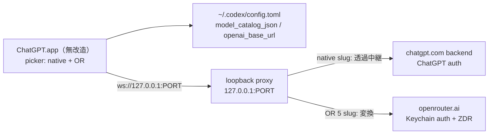

# Codex Loopback Router: ASARパッチ非依存の統合picker計画

作成日: 2026-08-12 / 対象: ChatGPT `26.803.61601` build `6396` 以降（build非依存を設計目標とする）

状態（2026-08-12）:

- 案B（loopback proxy / 案S・案I）: **Phase 0 不成立。停止**。理由は[§4.1](#41-phase-0-の結果2026-08-12)。設計記述は再開点として残す
- **案D（config切替 + OpenRouter専用guard）: Phase 0-C 実機検証まで完了。安全性は成立、実用性は判断待ち**。[§10](#10-案d-config切替--openrouter専用guardphase-0-c)。guardは必須。未決の争点は§10.7

## 1. 決定と前提

Codexは週2回以上更新される。ASARパッチ方式（[SESSION_CONTINUITY_PLAN.md](SESSION_CONTINUITY_PLAN.md)）は更新のたびにsemantic anchor再解析・patched hash再生成・ad-hoc署名・candidate昇格が必要で、この更新頻度では保守が破綻する。したがって**主案をloopback proxy方式へ切り替える**。

中核となる仕組み:

- 統合catalog（native全件 + OpenRouter 5モデル）を `model_catalog_json` で与える。**ASARパッチ不要**
- built-in `openai` providerの宛先を `openai_base_url` でローカルproxyへ向ける
- proxyがmodel slugを見て、nativeは上流へ透過中継、OpenRouter 5モデルはOpenRouterへ変換して送る
- `model_provider` は常に `openai`。providerが切り替わらないので、session・履歴・sidebar・resumeは無改造で維持される

**受け入れる代償**: nativeのChatGPT認証済みトラフィックが自前proxyを経由する。これは実測で確定した事実であり、回避経路は存在しない（§2）。この一点を許容できるかが方式選択の分岐点であり、本計画は許容する前提で書かれている。

## 2. 実測で確定している事実

同じ調査を繰り返さないための記録。すべて build 6396 / codex-cli 0.147.0-alpha.6.5 で実測。

| 事実 | 確認方法 |
|---|---|
| 統合catalog（native 8 + OR 5 = 13）はASARパッチ無しで通る。OR 5件は `visibility: list` | `codex debug models -c model_catalog_json=<merged>` → 13件返却 |
| catalogエントリは最小JSONだと拒否される（`missing field supported_reasoning_levels`）。native entryをcloneして差し替える方式が必須 | 同上 |
| **`openai_base_url` はChatGPTログイン時のnativeトラフィックも捕捉する** | `auth_mode="chatgpt"` の実auth下で `codex doctor --json` の endpoint が `wss://chatgpt.com/backend-api/...` → `ws://127.0.0.1:10100/v1/...` に変化 |
| 通信はWebSocket。proxyはHTTPだけでは不足 | 同上（`wss://` / `ws://`） |
| `thread/resume` は記録済みproviderが勝つ。configの`model_provider`より優先 | app-serverへ直接resumeを発行して確認 |
| `turn/start` に `modelProvider` は無く、リクエストはthreadに束縛されたproviderへ飛ぶ | schema実測 + 実リクエストの宛先確認 |
| pickerの可視性判定 `vQr` の第1項は常にfalse（呼び出し側が `additionalAvailableModels: void 0`） | app.asar内に該当文字列1件 |
| `model_catalog_json` はconfig load時のみ適用。per-thread overrideはno-op | codex config schema |
| 記録されたprovider idがconfigに無いとresumeがハードエラー（`Model provider ... not found`） | 一時CODEX_HOMEで再現 |

最後の1点は本方式では**発生しない**。全threadが `openai` として記録されるため、configから設定を消してもresume自体は成功する（モデルが解決できず上流エラーになるだけ）。これはASARパッチ方式に対する明確な優位点。

追記（Phase 0で判明・上表の訂正）: build 6396のbundled catalogは8件だが visibility は **`list` 5件（sol / terra / luna / gpt-5.5 / gpt-5.2）+ `hide` 3件（gpt-5.4 / gpt-5.4-mini / codex-auto-review）**。[SESSION_CONTINUITY_PLAN.md](SESSION_CONTINUITY_PLAN.md) §13の「list 7 + hide 1」は誤り。picker想定は 5 + 5 = 10件。

## 3. 共通アーキテクチャ

- 正本: `~/.codex`（純正と同一）、userDataも純正と同一
- 純正app本体は一切変更しない。ASAR・署名・adapter index・patched hashの管理が全て不要になる
- OpenRouterの鍵はmacOS Keychainからproxyが取得。app・config・環境変数・引数には渡さない

## 4. Phase 0: トラフィック確定（両案共通・必須）

proxyを書く前に、実際に何が流れるかを確定する。ここが未確定のままでは実装できない。

1. ログのみのpass-throughを `127.0.0.1:PORT` に立て、`openai_base_url` をそこへ向ける
2. 純正appでnativeモデルの短いタスクを1件実行し、次を記録する
   - protocol（WebSocket / HTTP）、path、upgradeの有無
   - model slugがどのメッセージのどのフィールドに現れるか（＝振り分け判定点）
   - 認証ヘッダの種類（Bearer / Cookie / attestation系）と、そのまま転送すれば通るか
   - streamingの形式とセッション終了条件
3. OpenRouter側の `responses` API との差分を洗い出し、変換に必要な項目を確定する
4. `chatgpt_base_url` を設定しない状態で上流ホストが正しく解決されることを確認する

**Phase 0の結果が「透過中継だけでnativeが正常動作する」でなければ、本計画は停止し[SESSION_CONTINUITY_PLAN.md](SESSION_CONTINUITY_PLAN.md)へ戻る。**

### 4.1 Phase 0 の結果（2026-08-12）

**不成立。透過中継はできない。** 停止条件§8の第1項に該当する。

1〜2は成立した。`openai_base_url = "http://127.0.0.1:10100/backend-api"` を置くと、chatgpt認証下のnativeトラフィックがそのままloopbackへ来る。中身も確定した。

| 項目 | 実測値 |
|---|---|
| protocol | HTTP/1.1 WebSocket upgrade（h2 Extended CONNECTではない） |
| path | `GET /backend-api/responses` |
| 認証 | `authorization: Bearer <JWT 1873字>` + `chatgpt-account-id` |
| その他ヘッダ | `openai-beta: responses_websockets=2026-02-06`、`originator: codex_cli_rs`、`version`、`user-agent`、`sec-websocket-extensions: permessage-deflate` |
| 上流 | `wss://chatgpt.com/backend-api/responses`（codex直結ではdoctorが101を確認） |

4で破綻した。**受け取ったバイト列をHostだけ書き換えて `chatgpt.com` へ中継すると 403 Forbidden**（`server: cloudflare`、body空、`__cf_bm` cookie付き）。原因の切り分け:

| クライアント | TLSスタック | 結果 |
|---|---|---|
| codex本体（直結） | rustls | **101** |
| python `ssl` 経由で中継 | OpenSSL | 403 |
| python 直接、同一ヘッダ・同一順序 | OpenSSL | 403 |
| curl（h1 / h2 とも） | LibreSSL | 403 |
| node `https` | OpenSSL | 403 |
| deno `fetch`（`/`・`/backend-api/me`+認証） | rustls | **200** |
| deno `Deno.connectTls` で手書きHTTP | rustls | 403 |
| deno 組込み `WebSocket`（ヘッダ付与不可） | rustls | **400**（CFは通過。origin が認証不足で拒否） |
| deno + `npm:ws`（ヘッダ付与可） | node互換=生socket | 403 |

path・認証・User-Agentを揃えても403は変わらず、`https://chatgpt.com/` のルートですら curl/node は403、deno `fetch` は200。**Cloudflare Bot ManagementがClientHello/HTTP構成のfingerprintで遮断している**と確定できる。認証やヘッダの不足ではない。

中継用の上流clientをこの遮断に通すには、特定のfingerprintを模倣し続ける必要がある。これは

- **保守が週2回より重い**。Cloudflareのルール更新頻度は非公開かつCodexの更新より速く、しかも失敗が突然・全面的に起きる。週2回のASAR追従を避けるために、より頻度が高く予測不能な追従を抱え込むことになり、方式選択の前提が逆転する
- **bot対策の回避そのもの**であり、自分のアカウントの自分のトラフィックであっても、他者のサービスのアクセス制御を迂回する実装になる

ため採らない。

派生して確定した事実:

- catalogエントリに provider / base_url に相当するフィールドは無い（entry keyの全和集合を確認）。**モデル単位のprovider指定はconfigだけでは不可能**で、振り分けはtransport層でしか行えない
- `wire_api = "chat"` は廃止済み。`responses` のみ
- 自前providerの `base_url` へは `POST /v1/responses` が認証ヘッダ付きで届く（OpenRouter側の経路自体はCloudflare問題と無関係に成立する）
- ~~configは実リクエスト発行時に遅延読み込みされる~~ → **誤り。Phase 0-Cで否定した**（sinkの再送が phase をまたいで混入した測定ミス）。正しくは §10.1 のとおり **provider は thread/start 時に束縛され、threadの生存期間中は不変**

### 4.2 派生案（案D）へ

Phase 0の失敗はnative中継のみに起因する。**nativeを一切中継しない**なら遮断に触れない。この方向をPhase 0-Cとして検証した結果は §10。

## 5. 案S: シンプル案 + update追従

「動くものを最短で、週2回の更新に自力で追従し、駄目なら黙って純正に戻る」。

### 5.1 構成

- proxy: 単一プロセス、自前実装。外部依存を足さない
- 判定: 最初のリクエストからmodel slugを読み、OR 5モデルの明示集合に含まれるかだけを見る。含まれなければnative扱い
- native: 上流へバイト透過中継。ヘッダを改変せず、本文をパースも保存もしない
- OpenRouter: Keychainから鍵を取得し、`responses` APIへ変換。`allow_fallbacks=false`、ZDR endpoints検証は既存の[models/registry.json](../../models/registry.json)と refresh/doctor 資産をそのまま流用
- catalog生成: `codex debug models --bundled` の全nativeエントリ + OR 5エントリ（native entryをcloneし slug / display_name / description / supported_reasoning_levels / priority を差し替え）
- display_nameに `[OpenRouter] ` prefixを入れる。**labelパッチ不要**
- config: marker block で `model_catalog_json` と `openai_base_url` の2キーのみ。rollbackはブロック削除
- launcher: update追従（§5.2）→ proxy起動 → health確認 → app起動

### 5.2 update追従

週2回の更新に人手を介さず追従する。launcher起動時に毎回実行し、4段階すべてfail closedで進める。

**1. 検知**

`/Applications/ChatGPT.app` の `CFBundleShortVersionString` と `CFBundleVersion` を、前回成功時に記録した値と照合する。一致していれば以降をスキップして即起動する（毎回のコストをほぼゼロにする）。不一致なら2へ進む。ASAR hashは検知には使わない（223MBのハッシュ計算を毎回走らせない）。

**2. catalog再生成**

新しいbuildの `codex debug models --bundled` を取り直し、native全件 + OR 5エントリのcompositeを組み直して原子的に置換する。前世代のcatalogは1つ前だけ保持する。

cloneテンプレートに使うnative entryはslug固定にしない（将来 `gpt-5.5` が消える）。「`visibility: list` のnative entryのうち最初の1件」を使い、必須フィールド（`supported_reasoning_levels` 等）を継承する。

**3. 契約検証**

再生成後に検証し、1つでも落ちたら**古いcatalogを維持したまま3へ進まず、degradeへ分岐する**。

- native entryが1件以上ある
- OR 5モデルが全件揃っている
- slug重複が無い
- OR entryの `supported_reasoning_levels` が registry.json の efforts と一致する

**4. native疎通canary**

**ここが update追従の本体**。catalogが正しくても、更新で通信仕様（protocol・path・認証ヘッダ）が変わればproxyの透過中継が壊れる。catalogの検証だけでは検知できない。

proxyを起動し、native側の最小往復を1回行う。成功すれば通常起動。失敗すれば**auto-degrade**する。

**auto-degrade**: `openai_base_url` のmarker blockだけを外してappを起動する。結果として

- nativeモデルは純正と同じ経路で直行し、**通常どおり使える**
- OpenRouter 5モデルはpickerから消える（catalogも前世代へ戻す）
- 既存threadは全て `openai` 記録なのでresumeできる。壊れない
- 起動時に「Codexの更新により OpenRouter 経路を一時停止した」と表示する

ASARパッチ方式では更新でパッチが当たらなくなればappが起動できないか、hash不一致で停止する。proxy方式は**更新で壊れてもnativeの日常利用は止まらない**。これが週2回更新の環境で案Bを選ぶ最大の理由であり、案Sに update追従 を含める理由。

**5. 復旧**

degrade状態は状態ファイルに記録する。次回起動時、記録済みbuildと現buildが同じならcanaryを再試行しない（毎回失敗を繰り返さない）。利用者が明示コマンドを叩いたとき、またはproxy側を修正して再検証したときにのみ再有効化する。

### 5.3 やらないこと

- opencodex等の外部OSSをvendorしない（スコープが大きく、ChatGPT account pool等こちらが望まない機能を含む）
- プロセス分離・監査ログ・watchdogは入れない
- 旧 `~/.codex-openrouter` の移行はしない
- 通信仕様の変化そのものへの自動追従はしない。検知してdegradeするところまでが案Sの範囲

### 5.4 Phase

1. Phase 0を実施
2. proxy実装 + catalog生成 + config marker block
3. update追従（検知 → 再生成 → 契約検証 → canary → degrade → 状態記録）を実装
4. 実機確認7件
   - picker表示（native + OR）
   - nativeで1タスク
   - ORで1タスク
   - 既存threadのresume
   - `openai_base_url` を外して即座にnative直行へ戻ること
   - **update追従**: 記録済みbuildを人為的にずらして再生成が走り、catalogが更新されること
   - **auto-degrade**: canaryを強制的に失敗させ、OR無しでnativeが正常に起動すること
5. launcher統合、README差分、tag

### 5.5 想定コスト

proxy本体とupdate追従が中心。ASARパッチ関連（patcher-js、adapter index、candidate昇格、署名検証、hash再現性、semantic anchor解析）を全て捨てられるので、既存コードは**増えるより減る**。update追従は既存の refresh/doctor の構造をそのまま流用できる。

## 6. 案I: 理想案（案Sの上位互換）

案Sを土台に、週2回の更新に恒久的に耐え、認証境界を検証可能にする。

### 案Sへの追加

1. **特権分離**: native中継とOpenRouter変換を別プロセスにする。中継側は鍵を一切持たず、変換側はChatGPTトークンを一切見ない。判定は接続受付時に一度だけ行い、以後は該当プロセスへ委譲する
2. **監査ログ**: provider / model / thread id / 方向 / バイト数 / 時刻のみ。本文とトークンは残さない。`scripts/secret_scan.py` の対象にログを追加しCIで検証
3. **事前追従と自動復旧**: 案Sの update追従 は起動時に同期実行するため、更新直後の初回起動が待たされる。これをバックグラウンド検知に変え、日常起動をブロックしない。degrade中も新buildが出るたびcanaryを自動再試行し、通れば自動復旧する。nativeモデルの増減は差分として通知する
4. **watchdog**: proxyをlaunchdで管理。異常終了時はappから見て明確に失敗させる（黙って上流へ直行させない）
5. **契約テスト**: OR 5モデルのslug・reasoning effort・ZDR実providerを既存doctorで継続検証。nativeは「透過中継でturnが完了する」ことをcanaryで継続検証
6. **wire API変換の網羅**: streaming、tool call、image入力、reasoning effort、context超過エラーの各経路をOR 5モデル分だけ表で管理する

### Phase

1. Phase 0
2. 案Sを完成させる（理想案は案Sのsupersetなので、まず案Sを動かす）
3. 特権分離とwatchdogを入れる
4. 監査ログ + secret scan + CI
5. 事前追従と自動復旧
6. 実機マトリクス（OR 5モデル × 公開effort、native 3系統、resume、degrade、復旧）

## 7. 比較と推奨

| 軸 | 案S | 案I |
|---|---|---|
| 実装量 | 小〜中 | 中 |
| 週2回更新への耐性 | ○ 起動時に再生成 + canary + auto-degrade | ◎ 事前追従・自動復旧・差分通知 |
| 更新で壊れたとき | nativeは使える（ORのみ停止） | 同左 + 次のbuildで自動復旧 |
| 認証境界の検証可能性 | native本文を触らない実装だが、検証手段は無い | プロセス分離 + 監査ログで検証できる |
| proxy障害時 | 起動時のcanaryで検知 | 起動後の障害もwatchdogが検知 |

**推奨: 案Sを実装し、動作確認後に案Iの項目を1つずつ足す。** 案Iは案Sのsupersetなので、最初から案Iを目指すと Phase 0 の結果が出る前に設計が固まってしまう。案Sが動いた直後に入れる価値が高いのは(1)特権分離と(3)事前追従。

## 8. 停止条件

- ~~Phase 0で、透過中継だけではnativeのturnが完了しない（attestation・Host固定・証明書pinning等）~~ → **2026-08-12に該当。実際の要因はCloudflare Bot ManagementのTLS fingerprint遮断（[§4.1](#41-phase-0-の結果2026-08-12)）**
- ChatGPTトークンがOpenRouterへ、OpenRouter鍵がnative経路へ1件でも混入する
- proxy障害時にnativeが黙って直行し、利用者が気づけない
- 既存threadのresumeまたはsidebar表示が壊れる
- `openai_base_url` を外してもnativeが元に戻らない
- catalog再生成でnativeモデルが欠落する、またはOR 5モデルのeffort契約が崩れる
- **update追従が失敗したときにdegradeへ落ちず、nativeまで使えなくなる**
- **degrade状態が利用者に見えない、または毎回起動のたびにcanaryを再試行して待たされる**
- doctor・secret scan・CIのいずれかが失敗する

## 9. ASARパッチ方式との関係

[SESSION_CONTINUITY_PLAN.md](SESSION_CONTINUITY_PLAN.md)（案A）は破棄せず、退避経路として保持する。案Aが優位なのは認証境界の一点のみ（nativeトラフィックがOpenAIへ直行する）。Phase 0で本方式が成立しない場合、または native通信をproxyに通すことが許容できなくなった場合に案Aへ戻る。

**2026-08-12: Phase 0不成立により、この退避条項が発動した。** 案Aの「nativeがOpenAIへ直行する」という性質は、単に認証境界上の優位というだけでなく、Cloudflareの遮断を踏まないための必須条件だったことが判明した。案Aへ戻る場合、着手前に既知の欠陥を先に潰すこと:

1. rollback欠陥 — `[model_providers.openrouter]` を削除するとOpenRouter記録threadのresumeが `Model provider \`openrouter\` not found` でハードエラーになる。ブロック削除だけのrollbackは成立しない
2. §13の bundled visibility 内訳が誤り（上記§2追記）。picker期待値は12件ではなく10件
3. 週2回更新への追従コストは未解決のまま。案Aを選ぶ以上、semantic anchorの再解析を自動化するか、更新のたびに手動昇格を受け入れるかを先に決める必要がある

両案は catalog composite・config marker block・registry/ZDR資産を共有するため、案Bで作る資産の大半は案Aでもそのまま使える。

## 10. 案D: config切替 + OpenRouter専用guard（Phase 0-C）

nativeを一切中継しない方式。**chatgpt.comへ接続するのは純正appだけ**になるので、§4.1のCloudflare遮断を構造的に踏まない。

### 10.1 Phase 0-C の実測（2026-08-12）

dummy provider `pA`(:10101) / `pB`(:10102) を置き、app-server稼働中に `model_provider` を切り替えて送信先を測った。各turnに固有のmodel tagを付け、sinkのヒットをtagで突き合わせている（tag無しで数えた初回測定は再送が phase をまたいで混入し、誤った結論を出した）。

| # | 操作 | 送信先 |
|---|---|---|
| T1 | pAでthread1作成 → turn | 10101 |
| T2 | configをpBへ → **同一thread1**でturn | **10101**（pAのまま） |
| T3 | 新thread2作成 → turn | 10102 |
| T4 | configをpAへ戻す → thread1でturn | 10101 |
| T5 | thread2でturn | **10102**（pBのまま） |

T5が決定的。configはpAなのにthread2はpBへ飛ぶ。**providerは `thread/start` 時に束縛され、threadの生存期間中は不変**。

app.asar側も確定した。

- `setDefaultModelConfig(model, effort, profile)` は `config/batchWrite` で **`model` と `model_reasoning_effort` だけ**を書く（`reloadUserConfig: true`）。**`model_provider` は書かない** → 外部プロセスが補う余地がある
- 既定モデル変更UIは `set-default-model-config-for-host` → 直後に **`clear-prewarmed-threads-for-host`**。appはthreadを**事前生成(prewarm)**している。束縛はprewarm時点で起きる
- **スレッド内のモデル変更は新threadを作らない**。`updateThreadSettingsForNextTurn(threadId, {model, effort})`、turn実行中なら interrupt → `thread/rollback` 1turn → 同一threadでturn再開。config.tomlは触られない

### 10.2 そのままでは漏れる

「configのmodel_providerをwatcherが追随させる」だけだと、**thread内モデル変更で漏れる**。threadが `openrouter` に束縛された状態で利用者がnativeモデルへ切り替えると、次のturnは同一threadのまま `openrouter` provider へ行く。すなわち **ChatGPTのpromptがopenrouter.aiへ送信される**。§8の最重要停止条件そのもの。これは稀なレースではなく、会話中にモデルを変えるという通常操作で起きる。

### 10.3 guardで塞ぐ

`[model_providers.openrouter]` の `base_url` を **localhostのguardへ向ける**。guardはOpenRouter経路専用で、chatgpt.comへは一切接続しない。

- 受けたリクエストの `model` がOR 5モデルの明示集合にあれば openrouter.ai へ変換して送る
- 無ければ**送信せずエラーを返す**。nativeのslugが来た時点で、1バイトも外へ出さずに止まる

これで全ての失敗が安全側に倒れる。

| 状況 | 送信先 | 結果 |
|---|---|---|
| thread=openrouter、ORモデル | guard → openrouter.ai | 正常 |
| thread=openrouter、nativeモデルへ変更 | guard | **guardが遮断**。外部送信なし |
| thread=openai、ORモデルへ変更 | chatgpt.com | 未知モデルエラー。自分のChatGPT宛なので漏洩ではない |
| watcherがレースに負けた | 上記いずれか | 誤routingにはならずエラーになる |

**レースに負けても誤routingは起きずエラーになる**、が案Dの成立根拠。watcherは正しさではなく成功率だけを担う。

### 10.4 受け入れる制限

- **thread途中でprovider境界をまたぐモデル変更は必ずエラーになる**。利用者は新しいthreadを立て直す必要がある。同一provider内の変更は自由
- `[model_providers.openrouter]` は永久に消せない（§2最終行のresume硬直エラー）。rollbackはblock削除ではなく、providerを残したままcatalogから隠す形にする
- watcherが `model` のwriteを検知してから次のthread生成までにmodel_providerを書き込む必要がある。`clear-prewarmed-threads-for-host` 直後の再prewarmまでが窓

### 10.5 実機検証の結果（2026-08-12）

実auth.jsonを複製した隔離CODEX_HOME(`/tmp/cx0/home`)と専用user-data-dirで純正appを起動し、`--remote-debugging-port` 経由のCDPでUIを操作して実測した（accessibility/screen recordingは未許可のため使わず、rendererのDOMを直接操作）。検証後に複製authは削除済み。

**項目2: 成立。** composerのモデル選択（会話開始前）は `config/batchWrite` を通り、config.tomlに `model` と `model_reasoning_effort` を書く。`model_provider` は触らない。クリックからファイル書き込みまで **約356ms**。

**picker表示も同時に確認できた。** ASARパッチ無しで **native 5 + OR 5 = 10件** がpickerに並び、`[OR] ` prefixで判別できる。§2追記の「listは5件」が実機でも裏取りされた。

**項目1: 窓は広い。成立。** thread生成は **モデル選択時でもprewarm時でもなく、最初の送信時**だった。

| 事象 | 実測 |
|---|---|
| モデル選択によるconfig write | T |
| thread生成（rollout birth） | **T+49秒**（＝送信操作の瞬間） |
| 外部から `model_provider` をopenrouterへ反転 → 9秒後に送信 | 新threadの `session_meta.model_provider` = **openrouter**、リクエストは **guard(:10103)へ着弾** |

つまりwatcherは「モデルを選ぶ→Enterを押す」までの人間の操作時間を丸ごと使える。レースは実質問題にならない。

**安全側の方向も実証。** thread=openai のままOR slugを送ると chatgpt.com が HTTP 400 を返す:
`The 'deepseek/deepseek-v4-pro' model is not supported when using Codex with a ChatGPT account.` 外部送信は発生しない。

### 10.6 新たに判明した阻害要因: appが自前でnative slugのthreadを立てる

**`model_provider` の反転はプロセス全体に効くため、利用者が選んでいない背景threadまでOpenRouterに束縛される。**

`model_provider = "openrouter"` の状態で1回送信しただけで、guardに **2本**着弾した。

| model | bytes | 利用者の入力を含むか | 認証 |
|---|---|---|---|
| `deepseek/deepseek-v4-pro` | 97,822 | ○ | OpenRouter key |
| **`gpt-5.6-luna`** | **43,369** | **○（canary文字列を確認）** | OpenRouter key |

`gpt-5.6-luna` は **app.asarにハードコードされている**。ambient suggestions と、その安全性分類（`ambient_suggestion_safety`）などに使われ、いずれも `startThread` で**自前のthreadを作る**。そのthreadは生成時点のconfigの `model_provider` に束縛されるので、OpenRouterへ飛ぶ。

- catalog側の対策では止まらない。OR entryの `multi_agent_version` をnullにしても再現した（app側の固定値でcatalog駆動ではない）
- codexのconfig schemaに該当キーが無く、**config.tomlからは無効化できない**（Electron側の機能）
- ChatGPTトークンは載らない（provider単位で認証が分離されているため）。**漏れるのは本文**

guardがあれば送信前に落ちるので**漏洩は起きない**。しかし
- guardは例外時ではなく**毎ターン発火する**
- 巻き込まれる背景機能はapp側の実装依存で、**週2回の更新のたびに増減しうる列挙不能な集合**
- 巻き込まれた機能はOR利用中サイレントに壊れる（ambient suggestionsが出なくなる等）

### 10.7 判定

**安全性は担保できる。実用性は未確定。**

- guardは任意ではなく**必須**。これ無しの案Dは毎ターン本文をOpenRouterへ送る
- レース窓・picker表示・configへの書き込み・安全側の失敗は、すべて実機で成立を確認済み
- 残る争点は「グローバルな `model_provider` 反転が背景threadを巻き込む」こと。これは設計の副作用ではなく**方式の性質**で、案Dを採るなら恒久的に付き合うことになる

次に決めるべきは、この巻き込みを許容するか否か。許容するなら、guardが弾いた背景threadを利用者に見せない（ログのみ）運用と、更新ごとに巻き込み対象を洗い直す手順が要る。
